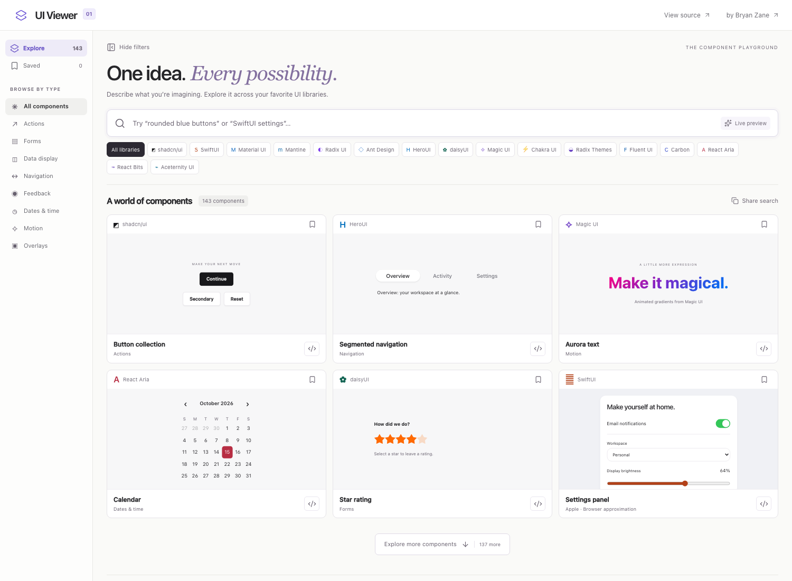

# UI Viewer

Search and customize 139 interactive UI previews across 14 component families, with live styling and Jev-powered description matching.


_Local preview with sample content. Library components load as they enter the viewport._


_The same description updates component colors, shape, and labels across libraries._


_Live deployment: a description of team records surfaces table components across libraries._

[Live app](https://bryanzane.com/ui-viewer/) · [Library attribution](docs/ATTRIBUTION.md)

## Quick start

Use Node 22.12+ and npm.

```sh
npm ci
npm run dev
```

Open `http://127.0.0.1:5173/ui-viewer/`.

```sh
npm run check       # Typecheck, catalog/source checks, production build
npm run preview     # Serve the static production build
npm run bundle      # Measure compressed shell assets
npm run test:previews # Check all previews with the preview server running
```

## Usage

Type `rounded blue buttons "Launch"`, `React Aria calendar`, `Magic UI animated text`,
or `SwiftUI settings`. Search updates locally on each keystroke. Smart search sends descriptions to Jev through OpenRouter after a short typing pause, then adds a confident semantic match. Turn it off beside the search field for local-only searching. Descriptions
support named colors or six-digit hex colors, dark mode, rounded/square,
compact, outline, and labels in quotes. Individual libraries retain their own
component behavior and supported design tokens.

Filter by library or category, save favorites in this browser, share a search
URL, and open a component to inspect its code and setup instructions. Six
results appear initially; load more to keep exploring. Offscreen frames unload,
so their interaction state resets when revisited. Typing appearance changes
updates mounted frames without resetting their state.

The catalog contains 139 interactive entries plus four reference links. Counts
are library/pattern combinations, not 139 unique component types. SwiftUI is a
clearly labeled browser approximation with Swift source for Xcode. React Bits
and Aceternity are reference links rather than bundled source.

The original six families offer starter snippets. New adapters show the actual
preview source, which imports the shared types/styles in this repository.
Samples are not complete production authentication, billing, or backend flows.

## Optional Jev search

The catalog works without API credentials. To enable semantic matching locally,
set `OPENROUTER_JEV_KEY` in your shell or a private environment file and run:

```sh
npm run build:server
PUBLIC_ORIGIN=http://127.0.0.1:5173 npm run start:server
```

Keep `npm run dev` running in another terminal. Vite proxies `/ui-viewer/api/`
to the loopback service at port 8040. Never prefix a secret with `VITE_` or put
it in frontend code. The live deployment reads a root-owned server environment
file outside this repository. Both `.env*` and build artifacts are ignored.

Jev requests are debounced by 450 ms, capped at 300 characters, cached for one
hour (1,000 entries), and limited to 20 requests/minute/client and 300 upstream
requests/hour with four concurrent requests. A five-second upstream timeout,
unknown output, low confidence, rate limits, or service failure leaves local
search available. The server does not log query text or API credentials.

## Architecture and performance

Static React + TypeScript + Vite, with an optional 17 KiB bundled Node service for
Jev search. No Next.js server or runtime component downloads. Local catalog search
uses keyword/prefix ranking; Jev chooses only from the existing component types.
Neither path executes user-supplied code. API keys stay in the server environment.

Each library has a lazy module. Same-origin preview frames isolate CSS resets,
providers, and portals. IntersectionObserver mounts frames near the viewport
and removes distant ones. Source text loads only when the inspector opens.
Carbon imports only the Sass components used here. All dependencies are pinned
in the lockfile, and Magic UI source is pinned with its MIT license.

`src/lib/explorer/catalog.ts` defines explicit support lists. `src/preview-main.tsx`
selects the lazy renderer. `src/components/explorer/` contains the shell and
library adapters. [Deployment notes](docs/DEPLOYMENT.md) cover static hosting.

## Screenshots

With `npm run dev` running:

```sh
npm run screenshots
# Or: UI_VIEWER_URL=http://127.0.0.1:4173/ui-viewer/ npm run screenshots
```

The script captures desktop, customized previews, and mobile screens using
Chromium. Run `npx playwright install chromium` if your machine has no browser.

## Contributing

See [CONTRIBUTING.md](CONTRIBUTING.md). Keep credentials, node_modules, and build
output out of git. Run `npm run check` before opening a pull request.

## License

[MIT](LICENSE). Derived from Shapeshift; upstream notices are retained. Component
libraries retain their respective licenses listed in [attribution](docs/ATTRIBUTION.md).
