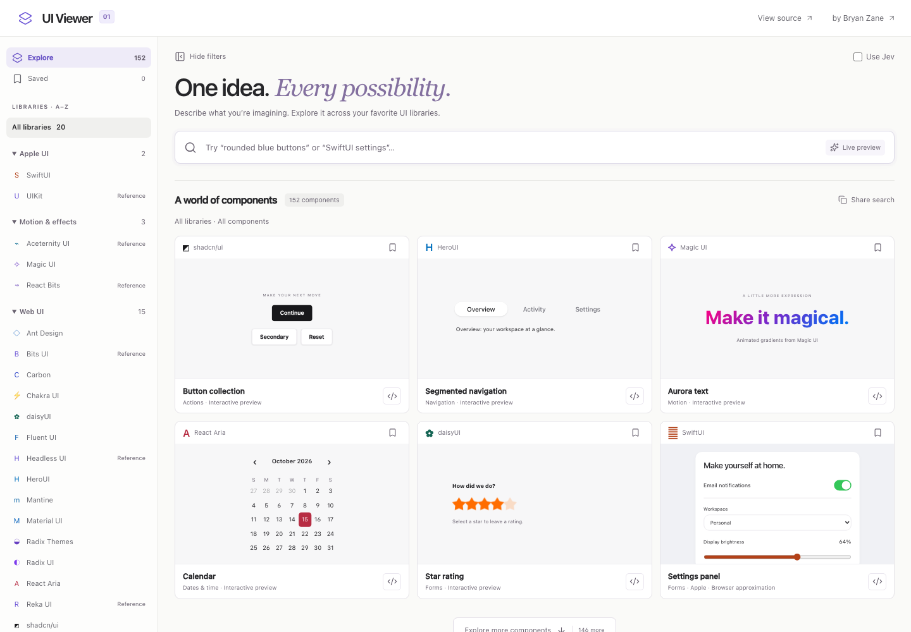
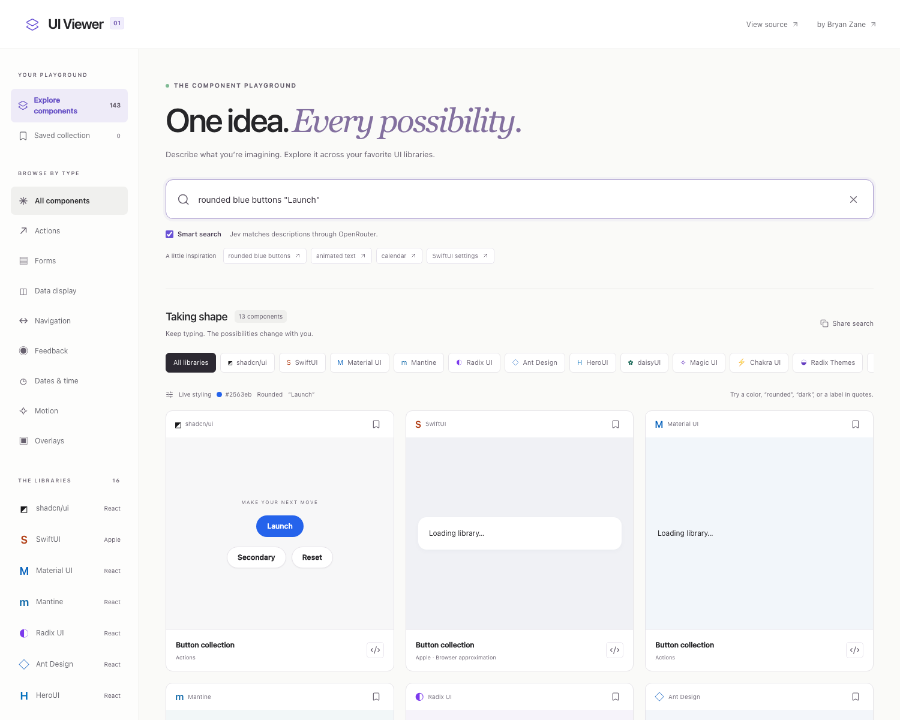
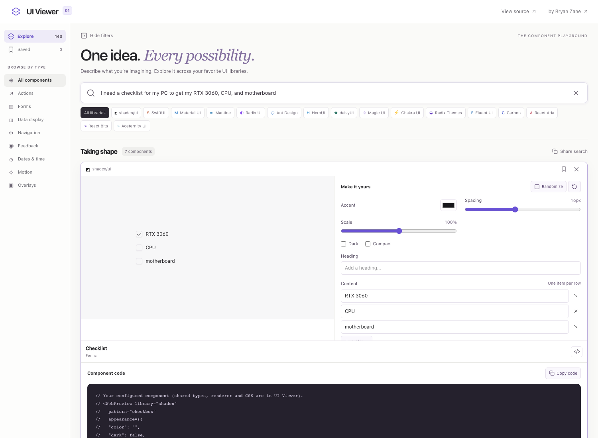

# UI Viewer

Search and customize 139 interactive UI previews across 14 component families, with live styling, inline editors, and Jev-powered content matching.


_Local preview with sample content. Library components load as they enter the viewport._


_Click a compact card to expand its live preview, intuitive controls, and configured code._


_Jev selects the requested content from your description and populates matching components across libraries._

[Live app](https://bryanzane.com/ui-viewer/) · [Library attribution](docs/ATTRIBUTION.md)

## Quick start

Use Node 22.12+ and npm.

```sh
npm ci
npm run dev
```

Open `http://127.0.0.1:5173/ui-viewer/`.

```sh
npm run check       # Typecheck, catalog/source checks, production build
npm run preview     # Serve the static production build
npm run bundle      # Measure compressed shell assets
npm run test:previews # Check all previews with the preview server running
npm run test:editor   # Exercise the editor with a running preview and mocked Jev responses
npm run test:search   # Regression check with controlled slow/stale search responses
```

## Usage

Type `rounded blue buttons "Launch"`, `React Aria calendar`, or
`I need a checklist for my PC to get my RTX 3060, CPU, and motherboard`.
Local matches and recognizable values update as you type, without a loading screen.
The **Use Jev** checkbox is off by default. Enable it to refine the component type
and contextual content in the background; unchecking it cancels pending AI work. Existing
context stays visible until the next response arrives; explicit colors, labels,
percentages, and item lists apply immediately. Clearing search resets the catalog.
Libraries are alphabetized within collapsible Apple UI, Motion & effects, and Web UI
sidebar groups. Component-type filters also live in the sidebar; active filters appear
above the results. The sidebar can be hidden and is scrollable on mobile.

Click any live preview to smoothly expand a workbench with color, corner, spacing,
scale, theme, and density controls, plus relevant text, list, percentage, price,
count, or star-rating inputs. Changes affect that card and its displayed code.
Randomize explores visual and numeric values while preserving your content;
Reset returns to your description. Escape collapses the editor when focus is in
its controls. Reduced-motion preferences are respected.

Descriptions support named/hex colors, dark/light themes, rounded/square corners,
compact/outline styles, quoted labels, `title "Downloads"`, `72%`, `$49`,
`radius 12px`, `gap 8px`, and explicit `items: RTX 3060, CPU, motherboard`.
Jev can also select content from natural phrasing without an `items:` prefix.
Content is copied from your text; the app does not invent arbitrary component code.

Save favorites, share a search URL, and load six more results at a time.
Offscreen frames unload, so interaction state resets when revisited. Style changes
preserve mounted interactions; changing list content resets list selection.
Per-card edits last while the card remains in the current search. Shared URLs
include the search and filters, not unsaved per-card edits.

The catalog contains 139 interactive entries plus 13 reference entries across 20 libraries. Counts
are library/pattern combinations, not 139 unique component types. SwiftUI is a
clearly labeled browser approximation with Swift source for Xcode. React Bits,
Aceternity, Bits UI, Headless UI, Reka UI, and UIKit are reference links rather than bundled source.

React previews show their configured props and actual adapter source, which imports
the shared renderer, types, and styles in this repository. SwiftUI offers a native starter.
Samples are not complete production authentication, billing, or backend flows.

## Optional Jev search

The catalog works without API credentials. To enable semantic matching locally,
set `OPENROUTER_JEV_KEY` in your shell or a private environment file and run:

```sh
npm run build:server
PUBLIC_ORIGIN=http://127.0.0.1:5173 npm run start:server
```

Keep `npm run dev` running in another terminal. Vite proxies `/ui-viewer/api/`
to the loopback service at port 8040. Never prefix a secret with `VITE_` or put
it in frontend code. The live deployment reads a root-owned server environment
file outside this repository. Both `.env*` and build artifacts are ignored.

Jev requests are debounced by 450 ms, capped at 300 characters, cached for one
hour (1,000 entries), and limited to 20 requests/minute/client and 300 upstream
requests/hour with four concurrent requests. An eight-second upstream timeout,
unknown output, low confidence, rate limits, or service failure leaves local
search available. The server does not log query text or API credentials.

## Architecture and performance

Static React + TypeScript + Vite, with an optional 22 KiB bundled Node service for
Jev search. No Next.js server or runtime component downloads. Local catalog search
uses keyword/prefix ranking; Jev chooses existing component types, supported style
values, and content spans anchored to the original query. Bounded values are
validated on both sides of the preview frame boundary.
Neither path executes user-supplied code. API keys stay in the server environment.

Each library has a lazy module. Same-origin preview frames isolate CSS resets,
providers, and portals. IntersectionObserver mounts frames near the viewport
and removes distant ones. Source text loads only when the inspector opens.
Carbon imports only the Sass components used here. All dependencies are pinned
in the lockfile, and Magic UI source is pinned with its MIT license.

`src/lib/explorer/catalog.ts` defines explicit support lists. `src/preview-main.tsx`
selects the lazy renderer. `src/components/explorer/` contains the shell and
library adapters. [Deployment notes](docs/DEPLOYMENT.md) cover static hosting.

## Screenshots

With `npm run dev` running:

```sh
npm run screenshots
# Or: UI_VIEWER_URL=http://127.0.0.1:4173/ui-viewer/ npm run screenshots
```

The script captures desktop, customized previews, and mobile screens using
Chromium. The semantic-search screenshot also requires the Jev service. Run
`npx playwright install chromium` if your machine has no browser.

## Contributing

See [CONTRIBUTING.md](CONTRIBUTING.md). Keep credentials, node_modules, and build
output out of git. Run `npm run check` before opening a pull request.

## License

[MIT](LICENSE). Derived from Shapeshift; upstream notices are retained. Component
libraries retain their respective licenses listed in [attribution](docs/ATTRIBUTION.md).
